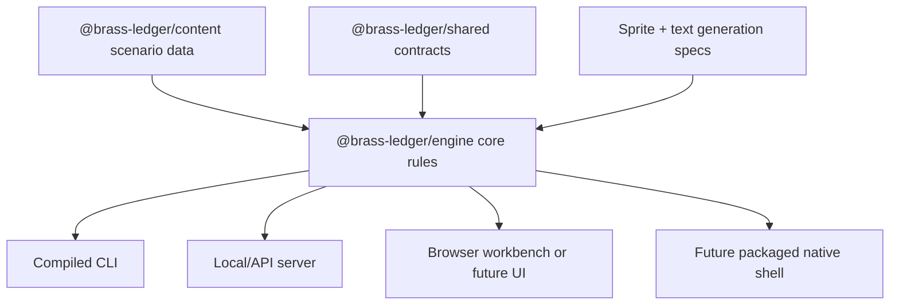

# Compiled Engine Roadmap

Backlink: [[POTATO]]

## Decision

Brass Ledger should be headless-first and compile-able. Browser UI is a client, not the game. The game engine should run from compiled JavaScript now, and the architecture should keep a path open for a packaged desktop/native shell later.

## Current Step Completed

A new workspace package exists at `apps/cli`. It builds with `tsc` and runs the engine without React, Vite, Fastify, or a browser.

Commands:

```bash
npm run build --workspace @brass-ledger/cli
npm run run --workspace @brass-ledger/cli -- --turns 3
npm run run --workspace @brass-ledger/cli -- --turns 1 --json --sprites
```

## Target Architecture



## Required Refactor

The current engine is split across `packages/sim`, `packages/shared`, and `packages/content`. That is workable, but the next stage should introduce a clearer `@brass-ledger/engine` package or formally treat `@brass-ledger/sim` as the engine package.

Recommended package boundaries:

| Package | Responsibility |
| --- | --- |
| `@brass-ledger/engine` | turn resolution, S1-S5 systems, replay, save canonicalization |
| `@brass-ledger/content` | scenario data, memo definitions, event definitions, sprite archetype inputs |
| `@brass-ledger/shared` | schemas and serializable data contracts only |
| `@brass-ledger/cli` | compiled headless runner |
| `@brass-ledger/server` | optional local/API wrapper |
| `@brass-ledger/web` | optional presentation client and engine workbench |

## Compile Targets

| Stage | Target | Notes |
| --- | --- | --- |
| Now | Node CLI compiled by `tsc` | Implemented as `apps/cli`. |
| Near | Single-command local executable script | Add bin wiring and release script. |
| Mid | Desktop wrapper | Electron chosen over Tauri (2026-07). |
| Later | Native/WASM evaluation | Evaluated and deferred (2026-08) — no current performance or distribution constraint forces it. See below. |

## Desktop Wrapper Decision (2026-07)

**Chosen: Electron.** Rationale:

- The engine is pure TypeScript/Node.js. Electron runs Node.js natively, so the engine can be spawned as a child process with no serialisation bridge.
- Tauri would require a Rust toolchain + a sidecar protocol (or WASM compilation of the engine), adding a new language build chain for marginal gain at this stage.
- Engine contracts are stable enough for wrapping — schemas, replay hashes, and the headless API are well-defined.
- The Electron wrapper is a **thin presentation host** — it spawns the compiled server bundle and opens a webview pointing at the same localhost URL. The shell contains zero rule logic.
- Keep the `desktop/` directory isolated from workspace builds. Core `npm run build`/`test`/CI pass without Electron installed.

The Tauri path remains open for later if distribution footprint becomes critical (the Electron binary is ~250MB, Tauri + system webview is ~10MB).

## Native/WASM Evaluation (2026-08)

**Recommendation: defer.** No current performance or distribution constraint forces a native/WASM target. Revisit only if automated balance-tuning needs to scale batch runs by another order of magnitude, or if a non-Electron, non-Node distribution target becomes a hard product requirement.

### Performance

Headless batch benchmark (`node apps/cli/dist/index.js --batch N`, Node v26.5.1, Apple M3 Pro, single run per size):

| Campaigns | Turns resolved | Wall time | Turns/sec | ms/turn |
| --- | --- | --- | --- | --- |
| 1 | 8 | 0.13s (mostly process startup) | — | — |
| 100 | 793 | 0.62s | ~1,280 | 0.78 |
| 1,000 | 7,893 | 4.32s | ~1,830 | 0.55 |
| 5,000 | 39,445 | 20.80s | ~1,900 | 0.53 |

Throughput asymptotes toward ~1,900 turns/sec as fixed process-startup cost (~130ms) amortizes. At steady state, a full 12-turn human campaign resolves in under 10ms of engine time — immaterial next to interactive/render latency. The batch mode's actual use (automated balance-tuning sweeps of hundreds to low-thousands of campaigns) completes in seconds; nothing in the current or near-term roadmap needs orders-of-magnitude more throughput than plain JS already delivers.

### Determinism/portability risk

Low, if this is ever revisited:

- No `Math.random()` anywhere in the deterministic core (`packages/sim`, `packages/shared`, `packages/headless`). All seeded randomness runs through a hand-rolled 32-bit PRNG (`createSeededRng`) and hash (`hashString`) built entirely from `Math.imul` and bitwise ops — operations with bit-exact, platform-independent results under IEEE 754, and the same primitives a Rust/AssemblyScript/C port would use.
- The only other `Math.*` calls anywhere in the deterministic core are `round`/`min`/`max`/`floor`/`ceil`/`imul` — all exactly specified, none of the transcendental functions (`pow`, `sqrt`, `sin`, `log`, ...) whose last-bit results can differ across libm implementations and are the usual source of cross-platform determinism bugs in lockstep simulations. The engine was, whether by discipline or accident, already written in a WASM/native-portable style.
- The one real portability wrinkle: `replayHash` in `packages/sim/src/index.ts` calls Node's `node:crypto` `createHash("sha256")` directly, so the deterministic core isn't currently platform-agnostic in the strict sense. This is a swappable integration detail, not an algorithmic divergence risk — SHA-256 is a fully specified standard, so any conforming implementation (a WASM-compiled `sha2` crate, `crypto.subtle` in a browser, a native binding) produces byte-identical digests. It is only used server/CLI-side today; the browser never recomputes a replay hash itself.

### Conclusion

Plain compiled JS via `tsc`/esbuild already meets every current performance and portability need. A future native/WASM port, if ever justified, has a clear, low-risk path because the engine already avoids the classes of non-determinism (uncontrolled RNG, transcendental math) that usually make such a port hard.

## Rules

- Engine state must be serializable.
- Renderer/browser state must never be authoritative.
- Sprites and text prompts are outputs of engine/content contracts.
- Save/replay must work from CLI without browser APIs.
- Any future UI should consume `decisionPackets`, `staffFunctions`, `spriteSpecs`, and `explainability` emitted by the engine.
