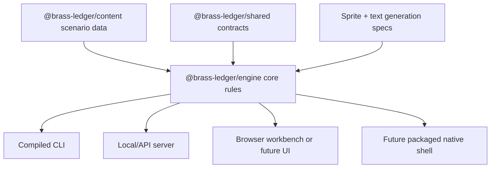

# Compiled Engine Roadmap

Backlink: [[POTATO]]

## Decision

Brass Ledger should be headless-first and compile-able. Browser UI is a client, not the game. The game engine should run from compiled JavaScript now, and the architecture should keep a path open for a packaged desktop/native shell later.

## Current Step Completed

A new workspace package exists at `apps/cli`. It builds with `tsc` and runs the engine without React, Vite, Fastify, or a browser.

Commands:

```bash
npm run build --workspace @brass-ledger/cli
npm run run --workspace @brass-ledger/cli -- --turns 3
npm run run --workspace @brass-ledger/cli -- --turns 1 --json --sprites
```

## Target Architecture



## Required Refactor

The current engine is split across `packages/sim`, `packages/shared`, and `packages/content`. That is workable, but the next stage should introduce a clearer `@brass-ledger/engine` package or formally treat `@brass-ledger/sim` as the engine package.

Recommended package boundaries:

| Package | Responsibility |
| --- | --- |
| `@brass-ledger/engine` | turn resolution, S1-S5 systems, replay, save canonicalization |
| `@brass-ledger/content` | scenario data, memo definitions, event definitions, sprite archetype inputs |
| `@brass-ledger/shared` | schemas and serializable data contracts only |
| `@brass-ledger/cli` | compiled headless runner |
| `@brass-ledger/server` | optional local/API wrapper |
| `@brass-ledger/web` | optional presentation client and engine workbench |

## Compile Targets

| Stage | Target | Notes |
| --- | --- | --- |
| Now | Node CLI compiled by `tsc` | Implemented as `apps/cli`. |
| Near | Single-command local executable script | Add bin wiring and release script. |
| Mid | Desktop wrapper | Use Tauri or Electron only after engine contracts stabilize. |
| Later | Native/WASM evaluation | Consider only if deterministic performance or distribution requires it. |

## Rules

- Engine state must be serializable.
- Renderer/browser state must never be authoritative.
- Sprites and text prompts are outputs of engine/content contracts.
- Save/replay must work from CLI without browser APIs.
- Any future UI should consume `decisionPackets`, `staffFunctions`, `spriteSpecs`, and `explainability` emitted by the engine.
