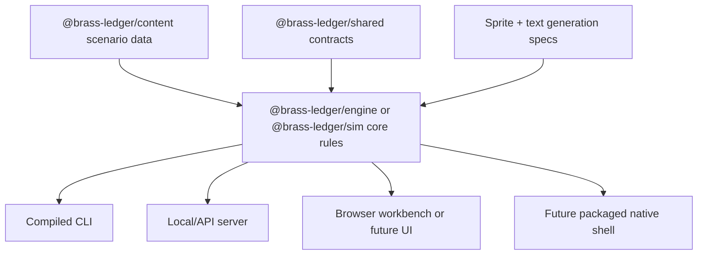

# Development Roadmap

Backlink: [[POTATO]]

This is the canonical development roadmap for Brass Ledger. It consolidates and cross-references all roadmap-related documents:

- [[development-stages]] — Historical stage definitions (Stages 0–6)
- [[roadmap-epics-and-issues]] — Current status and forward epics (Stage 7+)
- [[compiled-engine-roadmap]] — Compile targets and architecture
- [[game-engine-review/06-recommendations-and-roadmap]] — Review findings and recommendations
- [[doctrine-mechanics-roadmap]] — Doctrine expansion roadmap

## Current Status

**Stage 6 (Browser Interface Rebuild):** Built, in verification. Six-screen client under `apps/web/src`; polish bugs tracked in issues #35, #36.

**Forward roadmap:** Stages 7 and beyond are tracked as GitHub epics in [[roadmap-epics-and-issues]].

## Direction

Brass Ledger is a compile-able, headless-first game engine. Browser, CLI, server, and future native shells are presentation clients; the browser is not authoritative.

Rules:

- Engine state must be serializable.
- Renderer/browser state must never be authoritative.
- Save/replay must work from CLI without browser APIs.
- Sprites and text prompts are outputs of engine/content contracts.
- Any UI must consume engine contracts such as `decisionPackets`, `staffFunctions`, `spriteSpecs`, and `explainability`.

Target architecture:



Package boundaries:

| Package | Responsibility |
| --- | --- |
| `@brass-ledger/engine` or `@brass-ledger/sim` | Turn resolution, S1-S5 systems, replay, save canonicalization. |
| `@brass-ledger/content` | Scenario data, memo definitions, event definitions, sprite archetype inputs. |
| `@brass-ledger/shared` | Schemas and serializable data contracts only. |
| `@brass-ledger/cli` | Compiled headless runner. |
| `@brass-ledger/server` | Optional local/API wrapper. |
| `@brass-ledger/web` | Optional presentation client and engine workbench. |

## Stage 0: Source Of Truth And Headless Direction

Status: complete.

Goals:

- Consolidate all Obsidian notes into [[../GROCER]].
- Treat GROCER as the vault source of truth and POTATO as the engine/mechanics domain.
- Keep browser UI reduced to an engine workbench.
- Add compiled CLI route.

Exit criteria:

- `apps/cli` builds and runs.
- GROCER contains architecture, S1-S5, sprite, doctrine, world, and design notes.
- Browser is no longer the main game interface.

Implemented:

- `apps/cli` builds with `tsc` and runs the engine without React, Vite, Fastify, or a browser.
- Useful commands:

```bash
npm run build --workspace @brass-ledger/cli
npm run run --workspace @brass-ledger/cli -- --turns 3
npm run run --workspace @brass-ledger/cli -- --turns 1 --json --sprites
```

## Stage 1: Engine Contract Stabilization

Status: complete.

Goals:

- Define `StaffFunctionReadout`.
- Emit S1-S5 readouts from scenario/session payloads and turn previews.
- Add explainability entries to every turn result.
- Canonicalize save validation around replay.
- Move staff capacities and thresholds into content data.

Exit criteria:

- CLI can run a campaign and output S1-S5 consequences.
- Tests cover each S1-S5 function.
- Save/replay hardening findings from [[backend-review/review-summary]] are addressed.

Implemented:

- Shared schema and helpers emit S1-S5 readouts from scenario-owned staff function definitions.
- Server session payloads, preview/resolve results, and CLI headless summaries expose `staffFunctions`.
- `TurnResult.explainability` includes decision packet, staff capacity, state movement, and event causal references.
- Scenario `staffCapacities` owns directorate capacity, strain, and overload thresholds.

## Stage 2: S1-S5 Core Mechanic

Status: complete.

Goal:

Make S1-S5 burden the primary action economy. Every major decision should answer:

| Function | Player-facing question | Engine expression |
| --- | --- | --- |
| S1 | Can the people endure it? | Recovery debt, reserve predictability, personnel shortfalls, deployable units. |
| S2 | Is the picture reliable enough? | Estimate confidence, visibility, deception risk, warning reliability. |
| S3 | Can it be executed? | Visible posture, executable posture, training load, operations burden. |
| S4 | Can it be supported? | Stockpile depth, lift burn, depot backlog, munitions/fuel/lift sufficiency. |
| S5 | Does it fit the campaign? | Strategic coherence, doctrine alignment, cabinet cover, alliance alignment. |

Implemented:

- S1-S5 costs and warnings enforced on every decision option.
- Staff capacity prevents decisions from bypassing limits.
- S1 recovery debt and reserve predictability mechanics.
- S2 fog-of-war confidence, visibility, estimate classes, and deception risk.
- S3 visible posture separated from executable posture.
- S4 stockpile depth, lift burn, and supportable tempo.
- S5 strategic coherence, contradiction tags, doctrine alignment, and commitments.
- Accepted-risk previews and doctrine-bet after-action entries.
- S1-S5 boundary, interlock, and replay tests.

## Stage 3: Dual Tech Tree And Industry Model

Status: complete.

Goals:

- Implement internal capability nodes.
- Implement external industry nodes.
- Implement S2 estimates for external nodes.
- Link S4 constraints to external industry maturity.
- Link S5 plans to internal prerequisites and alliance feasibility.

Implemented:

- Tech tree can be simulated from CLI.
- Node changes emit explainability.
- Fog-of-war is deterministic under replay.

## Stage 4: Agent Chiefs And Negotiation

Status: complete.

Goals:

- Chiefs maintain agenda memory.
- Chiefs form support/objection coalitions.
- Conversations create commitments and trust effects.
- Player can negotiate staff constraints before commit.

Implemented:

- Chief advice is mechanically tied to S1-S5 readouts.
- Commitments can be fulfilled or broken in later turns.
- Conversation state remains replayable.

## Stage 5: Content Expansion And Balance

Status: complete.

Goals:

- Expand events from 6 to 30-50.
- Add more memo variants.
- Add scenario balancing telemetry.
- Add dominant-strategy detection from CLI batch runs.

Implemented:

- 1000 headless campaigns can run without replay drift.
- No simple default policy dominates.
- Multiple win paths are viable.

## Stage 6: Browser Interface Rebuild

Status: built, in verification.

Gate (exit criteria from Stage 5):

Do not rebuild the full browser interface until these engine contracts exist:

- `staffFunctions` array with S1-S5 labels and current values.
- `explainability` entries with causal references.
- `spriteSpecs` or `assetPrompts` for generated images.
- `availableActions` or `decisionPackets` that are already presentation-ready.
- Replay-safe save/import hardening from the backend review.

Goals:

- Rebuild the browser around [[s1-s5-user-interface-model]].
- Use [[game-engine-review/05-browser-design-system]].
- Keep UI as a client of engine contracts.

Implemented:

- Browser consumes `StaffFunctionReadout`, `decisionPackets`, `spriteSpecs`, and `explainability`.
- No browser-only rule logic.
- Six-screen command-console UI.

Remaining:

- Polish and integration bugs tracked in [[roadmap-epics-and-issues]].

## Forward Roadmap

See [[roadmap-epics-and-issues]] for:

- Stage 7: Packaged Game (#41)
- Sprite & Asset Generation Pipeline (#48)
- Doctrine Faction-Gene System & Optional Staff Modules (#49)

## Long-Term USP Filter

Every feature should pass this question:

Does it make deterrence, bureaucracy, legitimacy, or institutional sequencing more playable?

If not, it is probably a distraction from Brass Ledger's strongest identity.
