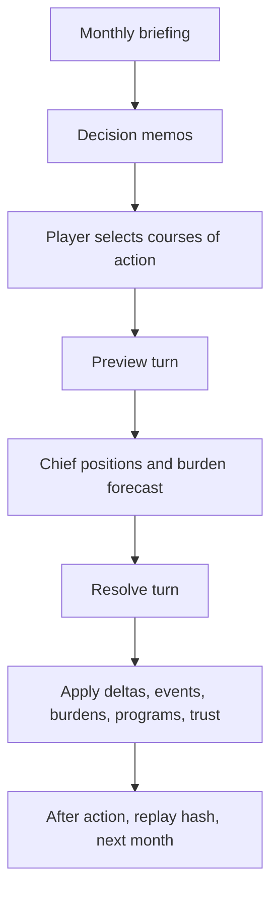

Backlink: [[POTATO]]

# Engine And Mechanics Model

## Current Engine Loop

The current implementation already has a strong deterministic engine foundation in `packages/sim/src/index.ts`. The server should become thinner over time, and the engine should become more data-driven.

## Real-World Scenario Basis

| Real-world concept | Game mechanic | Why it works |
| --- | --- | --- |
| Joint staff directorates | S1-S5 portfolio functions | Makes bureaucracy legible as gameplay. |
| Readiness reporting | Deployable units, training throughput, reserve strain | Turns abstract readiness into visible tradeoffs. |
| Intelligence uncertainty | Confidence, warning reliability, deception pressure | Prevents perfect-information optimization. |
| Sustainment bottlenecks | Depot backlog, munitions, fuel, lift | Forces realistic sequencing before visible posture. |
| Political authorization | Cabinet cover, committee tolerance, media heat | Makes democratic constraints part of strategy. |
| Alliance management | Reassurance, alignment, participation, public support | Rewards coalition shaping instead of unilateral action. |
| Industrial base | Capability programs and external constraints | Links procurement promises to real production limits. |
| Crisis escalation | Probe tempo, warning time, incident ladder, sensitivity | Creates failure states short of total war. |

## Popular Game Mechanics To Borrow

| Reference mechanic | Source pattern | Brass Ledger adaptation |
| --- | --- | --- |
| Action economy | Board games, XCOM strategic layer | Monthly staff capacity and burden limits. |
| Card/event deck | Twilight Struggle, Pandemic | Scenario events triggered by tags, flags, and turn windows. |
| Worker placement | Eurogames | S1-S5 portfolios absorb limited work each turn. |
| Relationship pressure | Crusader Kings, visual novels | Chiefs shift support based on trust, doctrine, and outcomes. |
| Fog-of-war tech estimates | 4X games | S2 estimates external industry maturity with confidence bands. |
| Crisis tracks | Pandemic, Defcon-style tension | Incident ladder and escalation pressure as loss vectors. |
| Deck/tableau build | Slay the Spire, engine builders | Capability programs become a long-run institutional engine. |
| Explainable resolution | Into the Breach | Preview should expose enough causal logic to feel fair. |

## Engine Pillars

1. **Server-authoritative deterministic resolution**: the client submits intent, never final state.
2. **Data-first content**: memos, events, programs, and staff capacities should become scenario data.
3. **Explainability by default**: every delta should know its top drivers and blockers.
4. **Staff capacity as action economy**: every choice must land somewhere institutionally.
5. **Strategic delay**: good decisions should often pay off later, while bad sequencing creates compounding debt.
6. **Soft failure before hard failure**: losing legitimacy, alliance trust, warning confidence, or staff execution should hurt before it ends the game.

## Recommended Resolution Order

1. Load canonical scenario and current session state.
2. Validate player intent against available memos/actions.
3. Convert intent into portfolio load, resource spend, tags, and commitments.
4. Resolve S2 intelligence confidence and unknowns.
5. Resolve external constraints and industry drift.
6. Resolve internal readiness/program progress.
7. Resolve political/alliance response.
8. Resolve adversary probe/escalation response.
9. Apply staff burden penalties.
10. Update chiefs, trust, event flags, narrative logs, replay hash.

The current engine resolves many of these, but S2 fog-of-war and the dual tech tree should be promoted from planning docs into first-class engine modules.

## Text And Sprite Generation Role

The engine should output structured text packets rather than final prose-only screens:

- `briefingText`
- `memoText`
- `chiefPositionText`
- `conversationTranscript`
- `afterActionNotes`
- `spritePrompts`
- `spriteSpecs`
- `explainabilityEntries`

The browser can then decide how to present them. This preserves the engine as a content generator and avoids tying game rules to UI layout.
