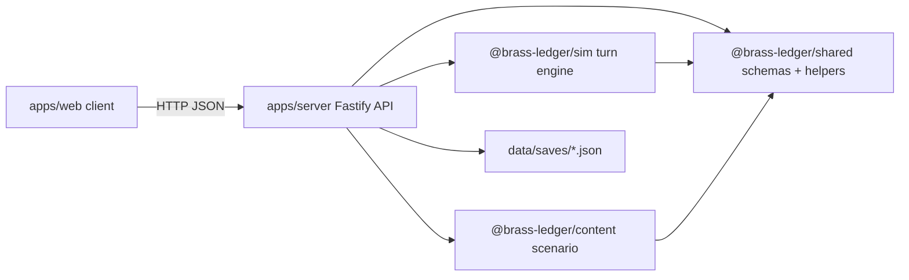

Backlink: [[POTATO]]

# Architecture Map

## Runtime Shape

## Component Responsibilities

| Component | Role | Review record |
| --- | --- | --- |
| `apps/server` | Fastify API, static asset serving, save file IO, session lifecycle | [[components/server]] |
| `packages/sim` | Deterministic game turn resolution, preview, replay validation | [[components/simulation]] |
| `packages/shared` | Zod contracts, state summaries, advisor/chief conversation helpers | [[components/shared-contracts]] |
| `packages/content` | Scenario data and content validation script | [[components/content]] |
| `data/saves` | JSON save persistence | [[components/file-save-store]] |

## Key Data Flow

1. New sessions are created in `apps/server/src/index.ts` using `createInitialGameSession(soloScenario, sessionId)`.
2. The server writes the whole session to `data/saves/{id}.json`.
3. Turn previews call `previewTurn`, which internally calls `resolveTurn` but does not persist.
4. Turn resolution reads the saved session, parses `TurnInput`, calls `resolveTurn`, appends input/result history, validates replay, writes the next session, and returns the payload.
5. Conversations mutate `state.conversationHistory` and `state.chiefTrust`, then write the whole session back.
6. Export returns the whole saved session; import parses a whole exported session and writes it with a new id.

## Design Strengths

- Simulation is separated from HTTP concerns.
- Shared Zod schemas give a clear contract boundary.
- Replays are deterministic enough to hash and validate.
- Save writes use temp-file plus rename, avoiding torn writes for a single write operation.
- Content validation catches duplicate ids and broken program/constraint references.

## Design Gaps

- The API exposes full session mutation, so the server is not the sole source of truth.
- Replay validation exists but is not consistently enforced before persistence.
- Local file persistence has no revision or lock, so concurrent requests can overwrite each other.
- CORS is permissive despite mutation endpoints.
