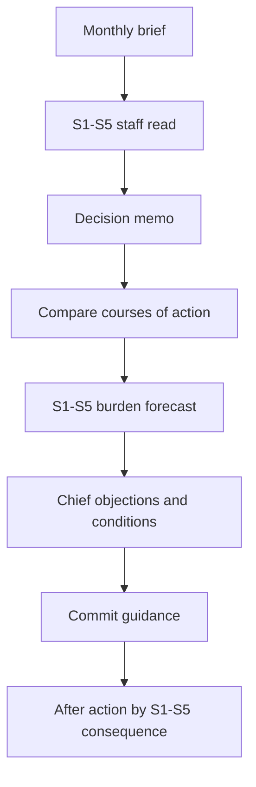

# S1-S5 User Interface Model

Backlink: [[POTATO]]

## Core Mechanic

S1-S5 is the game board. The player should not experience staff functions as side stats. Every decision should visibly pass through S1-S5, showing what the headquarters can absorb, what breaks first, and who owns the risk.

## Player-Facing Staff Functions

| Function | Label | Player question | Primary output |
| --- | --- | --- | --- |
| S1 | Personnel | Can the force absorb the human cost? | Endurance warning |
| S2 | Intelligence | Is the picture reliable enough to act? | Confidence warning |
| S3 | Operations | Can the posture be executed credibly? | Posture warning |
| S4 | Logistics | Can support reality carry the promise? | Sustainment warning |
| S5 | Plans | Does this month fit the long strategy? | Coherence warning |

## User Flow



## Per-Function Interface Contract

Each staff function needs the same engine contract:

```ts
type StaffFunctionReadout = {
  id: "S1" | "S2" | "S3" | "S4" | "S5";
  label: string;
  current: number;
  capacity: number;
  burdenAccepted: number;
  status: "ready" | "strained" | "overloaded" | "compromised";
  warning: string;
  failureMode: string;
  nextMonthConsequence: string;
  chiefId: string;
  evidenceRefs: string[];
};
```

## Presentation Rules

- Always show all five functions together before a decision is committed.
- Use consistent status language across functions.
- Give each function one current warning, not a wall of prose.
- Make the burden forecast visible while comparing options.
- Put chief advice behind each S-function rather than in a separate disconnected character layer.
- After action should report consequences by S-function first, then by global KPI.

## Decision Memo Layout

Recommended memo structure:

1. Problem statement.
2. Current S1-S5 read.
3. Courses of action.
4. Side-by-side S1-S5 burden forecast.
5. Chiefs paper.
6. Commit.

## Best Presentation By Function

### S1 Personnel

Show endurance, reserve strain, personnel shortfalls, and recovery debt. Use plain language: "This borrows from next month's force."

### S2 Intelligence

Show confidence bands, not just a score. Mark facts as known, estimated, or rumored. Highlight which assumption is dangerous.

### S3 Operations

Show visible posture versus executable posture. The core tension is whether a move deters or merely performs readiness.

### S4 Logistics

Show a support ledger: lift, fuel, repair, munitions, depot backlog. The player should see what promise becomes physically impossible.

### S5 Plans

Show strategic coherence: doctrine, alliance commitments, modernization queue, political story, and contradictions created by current guidance.

## Engine Implication

The engine should emit S1-S5 readouts every time it emits memos, previews, and after-action results. If a UI has to infer staff impact by reading raw state metrics, the engine contract is not mature enough.
